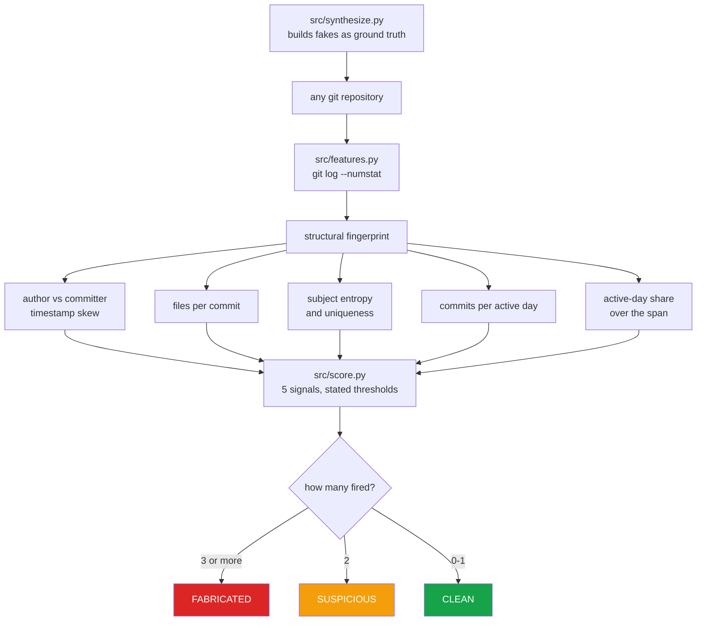

# commit-history-forensics

**A fabricated GitHub contribution graph is easy to make and easy to detect — including
when the forger knows to hide the obvious tell.**

Contribution-graph generators produce a year of green squares in minutes. This measures
how well they hide, using only *structural* properties of the history — timestamps,
uniformity, cadence — so the verdict holds regardless of what the code contains.

Nothing here is trained. Every threshold is written in `src/score.py` next to the
reasoning for it, so a reader can disagree with a specific number rather than with a
black box.

---

## Measured result

Evaluated on **25 genuine repositories** (24 real repositories with real history, plus a
control repo committed normally) and **2 fabricated ones** generated by
`src/synthesize.py`:

| | Repos | Verdict |
|---|---|---|
| Genuine histories | **25** | **25 CLEAN** — 0 false positives |
| Fabricated, naive | 1 | **FABRICATED** (4 / 5 signals) |
| Fabricated, committer date concealed | 1 | **FABRICATED** (3 / 5 signals) |

The second row is the one that matters. **Setting `GIT_COMMITTER_DATE` defeats the
timestamp signal entirely — and the forgery is still caught**, because it edits exactly
one file in every commit and real work does not.

| Repository | median author→committer gap | files per commit |
|---|---|---|
| `fake_naive` | **37 days** | **1.00** |
| `fake_hidden` | 0 days | **1.00** |
| control (genuine) | 0 days | 3.2 |
| 24 real repositories | 0 days | 1.0 – 95.6 |

---

## The five signals

| Signal | What it catches | Defeated by |
|---|---|---|
| `backdated_commits` | `git commit --date` sets **only** the author date, leaving a gap to the committer date | also setting `GIT_COMMITTER_DATE` |
| `single_file_every_commit` | generators edit one log file; real commits vary | committing varied files |
| `templated_messages` | every subject unique *and* every commit one file — a timestamp template | writing varied messages |
| `implausible_cadence` | many single-file commits per active day | committing less |
| `saturated_calendar` | commits on most days across a long span | leaving gaps |

Three or more signals ⇒ `FABRICATED`. Two ⇒ `SUSPICIOUS`. One ⇒ `ONE FLAG`.

## Known limitation — stated, and asserted in the tests

An adversary who **both** conceals the committer date **and** keeps the fabricated
history short (under ~60 days, few commits per day) defeats three of the five signals.
Only uniformity still fires, so the verdict is `SUSPICIOUS`, not `FABRICATED`.

This is not hidden in a footnote: `test_short_hidden_fake_is_only_suspicious` asserts it,
so the limitation cannot quietly disappear or quietly get worse.

**The evaluation set is also small** — 25 genuine repositories, mostly with fewer than 15
commits each, all by one author. Signals gated on commit count never fire on them, which
is why there are no false positives but also why that result is weaker evidence than it
looks. A larger and more varied genuine corpus is the obvious next step.

---

## Reproduce

```bash
python src/features.py  <folder-of-repos>   # raw fingerprints
python src/score.py     <folder-of-repos>   # verdicts
python src/synthesize.py <output-folder>    # build fakes to test against
streamlit run ui/app.py                     # dashboard
```

The dashboard reads `git log` live, so verdicts describe the repositories as they are
now, and every figure comes from the same functions the CLI uses.

## Tests

13 tests, no network, no committed fixtures — each test **builds real git repositories**
with real commits in `tmp_path`, so what is asserted is behaviour against real git
objects rather than against a mock.

```bash
pytest -q
```

## Why build the detector and not the generator

This started from evaluating a contribution-graph generator. Using one is a bad trade: it
fabricates history, it is detectable by everything above, and a single fabricated repo
makes a reviewer re-read all the genuine ones with suspicion. The interesting half — and
the one that is defensible to publish — is measuring how visible the fabrication is.

`src/synthesize.py` exists **only** to produce ground truth for the detector. It writes to
a temporary directory and pushes nowhere.

---

## How it works



Nothing is trained. Every threshold sits in `src/score.py` beside its reasoning, so a
reader can disagree with a specific number rather than with a black box.

---

## Problems hit while building this

| Problem | What happened | Fix |
|---|---|---|
| **Empty repo crashed** | `git log` exits non-zero on a repo with a branch but no commits, so the scanner raised `RuntimeError` instead of reporting an empty history | Detect that specific stderr and return an empty list; the caller decides what emptiness means |
| **A short fake only reached SUSPICIOUS** | Shrinking the test fixture to 40 days silently defeated two signals gated on a 60-day span. The easy move was to lengthen the fixture and say nothing | Kept **both**: a 90-day fixture asserting FABRICATED, *and* a 40-day one asserting the weaker verdict, so the limitation is documented rather than hidden |
| **CI could not commit** | The tests build real git repositories, and the runner has no git identity, so every fixture failed | Configure `user.name`, `user.email` and `init.defaultBranch` in the workflow |
| **`subprocess.run` lint failure** | `ruff` flagged a missing `check=` on calls that deliberately inspect the return code themselves | Passed `check=False` explicitly, with a comment saying why |
| **CI cache misconfigured** | `setup-uv` errors outright when its default `**/uv.lock` glob matches nothing | Keyed the cache on `pyproject.toml` |

---

## Future work

1. **A larger, more varied genuine corpus.** 25 repositories with roughly five commits
   each, all by one author, is weak evidence for "no false positives". Mining a few
   hundred real public repositories would make that claim mean something.
2. **Multi-author signals.** Every repository tested has a single author. Real projects
   have contributor distributions, review latency and merge patterns that a generator
   does not reproduce.
3. **Diff-content signals.** The current signals are purely structural. Whether commits
   change meaningful code, or rewrite the same line forever, is unused.
4. **Calibrated scoring** instead of a 3-of-5 rule: a likelihood ratio per signal would
   produce a probability rather than a label.
5. **Harden against the documented evasion** - a short, committer-date-faked history with
   varied files and messages currently reaches only SUSPICIOUS.
6. **Ship as a GitHub Action** that reports on a pull request.

---

## Stack

`Python 3.11+` · `git` · `Streamlit` · `Altair` · `pandas` · `pytest` · `ruff` ·
`GitHub Actions` - the detector itself uses the standard library only

## Keywords

git forensics · commit history analysis · fake GitHub contributions · contribution graph ·
fabricated commits · backdated commits · GIT_COMMITTER_DATE · git metadata analysis ·
developer analytics · repository mining · MSR · fraud detection · anomaly detection ·
software engineering research · resume verification · open source integrity

## Layout

```
src/features.py     structural fingerprint of a history, from `git log`
src/score.py        five signals with stated thresholds, and the verdict
src/synthesize.py   generate fabricated histories (ground truth for evaluation)
ui/app.py           Streamlit dashboard
tests/              13 tests that build real repositories
```
